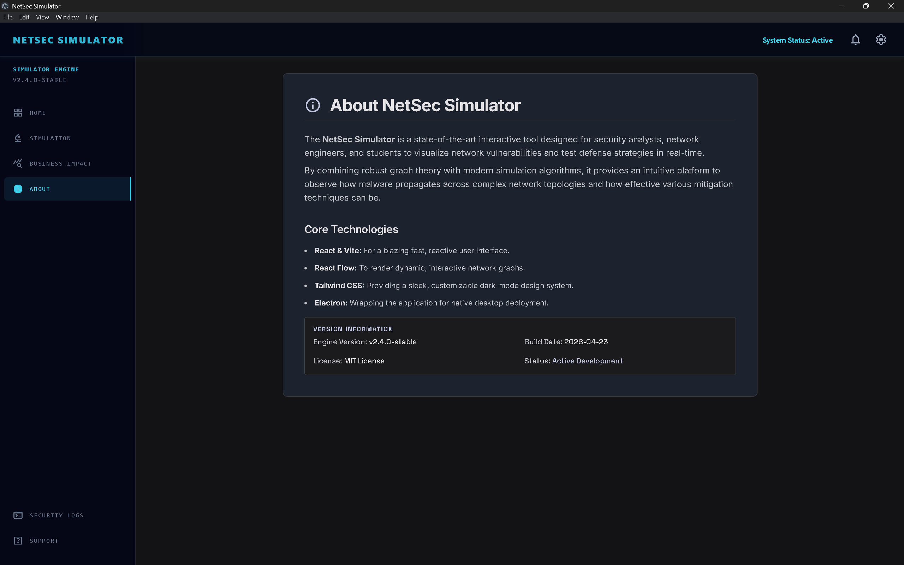
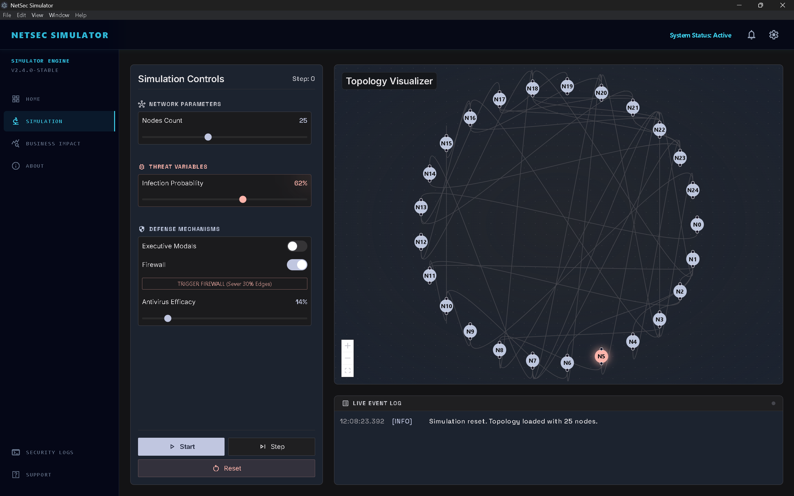

# NetSec Simulator

A professional network security simulation tool built with React and Electron.

## Features
- Interactive network nodes
- Malware spread simulation
- Executive Decision Modals
- Real-time visualization

## Gallery

*The main dashboard of the NetSec Simulator*

*Real-time visualization of malware spreading across the network*

## Setup
1. Clone the repository
2. Install dependencies: `npm install`
3. Run development mode: `npm run dev`
